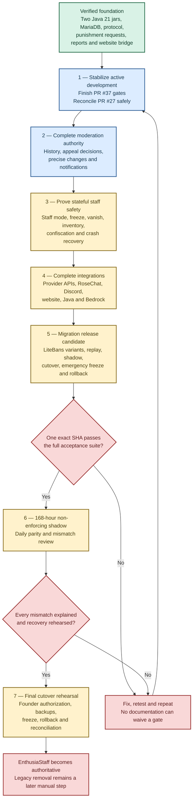

# EnthusiaStaff development blueprint

This document turns `ENTHUSIASTAFF-GOALS.md` and
`reports/REQUIREMENTS-MATRIX.md` into an ordered path from the current codebase
to a production-authoritative EnthusiaStaff release. It is a planning and review
tool, not a release promise and not a substitute for exact-SHA evidence.

## Current checkpoint

At this documentation checkpoint:

- `main` is `3f4e2a1164d570aadfb82522b07b4b32c9f2a7f9` after merged PR #36 completed the LiteBans shadow-comparison decomposition.
- PR #36 final head `3afeffc926571170e8df18c7d096ca7f4d89ec1b` passed 40/40 clean Java 21 tasks, 99 suites / 398 tests, and all 68 tests across 15 MariaDB 11.8.3 Testcontainers suites.
- PR #36 also passed hosted Codacy with zero new findings, three fixed findings, 92.59% diff coverage, no clone increase, and exact-SHA Pi staging run `30709333535`.
- Draft PR #37 is the active LiteBans cutover-coordination workstream. Its current first checkpoint adds focused MariaDB coverage but is not a completed or fully validated section.
- Draft PR #27 remains separate concurrent punishment-request notification, staff-mode, and freeze work. It must be reconciled without discarding, duplicating, or silently overriding its 95-commit history.
- EnthusiaStaff is not approved to replace LiteBans or the current production staff stack.

Checkpoint numbers above must be replaced when a newer exact head completes all
claimed gates. A green branch proves only its tested scope.

## Status language

| Status | Meaning |
| --- | --- |
| **Built** | A code path exists, but complete behavior is not proven. |
| **Tested** | Relevant automated tests ran successfully at one exact commit. |
| **Pi verified** | The standalone Paper boot/storage/command/shutdown subset passed for one exact SHA. |
| **Staging required** | Real Paper, Velocity, provider, Bedrock, Folia, multi-server, load, or failure behavior remains unproven. |
| **Blocked** | A required API, repository, environment, secret, dataset, or client is unavailable. |
| **Release gate** | Evidence required before production authority can move from LiteBans. |

## Road to production

## Milestones and exit criteria

### Milestone 0 — Preserve the verified foundation

Current exact checkpoints demonstrate substantial foundations:

- exactly two Java 21 runtime jars and provider-API packaging checks;
- MariaDB authority, migrations, transactions, leases, journals, inboxes and outboxes;
- authenticated persistent Paper–Velocity communication;
- durable punishment drafts, request submission, review and authority boundaries;
- report submission/replay/query/state separation, privacy filtering and evidence retention;
- restricted signed website transport, public projections, codes and appeal contracts;
- improved vanish audience coordination, reconnect fencing and entity-owner scheduling;
- deterministic LiteBans schema inspection and persisted shadow comparison dimensions;
- exact-SHA standalone Paper boot/storage/command/shutdown staging.

**Exit rule:** later phases must preserve these guarantees. A regression moves the
affected workstream backward regardless of how much newer code exists.

### Milestone 1 — Converge active branches

Primary work:

1. Finish PR #37's cutover-coordination implementation and complete validation.
2. Review PR #27 against the latest `main` and preserve its notification,
   staff-mode and freeze work.
3. Resolve overlap deliberately; do not retain parallel sources of truth.

Exit criteria:

- clean Java 21 build and all MariaDB suites;
- exactly two inspected runtime jars;
- Wiki validation and hosted quality checks;
- exact-head Pi gate when eligible;
- no lost or duplicated lifecycle behavior;
- updated requirements matrix and workspace manifest identifying one clean root checkpoint.

### Milestone 2 — Complete moderation authority

Deliver:

- `/history` with permission-safe case and sanction history;
- precise reduction, ending, revocation, removal, overturn and appeal-linked decisions through one audited service path;
- durable request submitted, claimed, approved, denied, expired and externally fulfilled notifications;
- offline and restart-safe requester/approver delivery;
- complete escalation families, decay, recency, aliases, removed IDs and frozen policy versions;
- exact operational-mode feature gates for every moderation action.

Exit criteria include stale-fence, duplicate-delivery, restart, multi-server
contention, authorization and failure-injection evidence.

### Milestone 3 — Prove stateful staff and asset safety

Deliver and stage:

- staff-mode snapshots, checksums, revisions, crash resume, location/server restore and leak prevention;
- complete freeze restrictions, reconnect/offline/extension behavior and staff-only communication;
- vanish coverage across entities, tracker packets, tab, counts, commands, completions, chat, voice, effects, containers and public APIs;
- inventory and Ender revisions, concurrent viewers, dirty slots, nested containers, offline replacement, queued patches and quarantine;
- item and economy confiscation with exact before/after evidence and idempotent restoration;
- staff hotbar/tester lifecycle, fake entity and `/fakebase` behavior.

Exit criteria require real Paper/Leaf and Folia ownership tests, Java and Bedrock
clients, provider behavior and crash/failure windows that mocks cannot prove.

### Milestone 4 — Complete providers and website

Required provider work:

- EnthusiaCurrency exact moderation snapshots and idempotent plans;
- EnthusiaCommend persistent reputation restrictions at every write path;
- EnthusiaAutoClicker versioned bounded client evidence;
- RoseChat pre-broadcast moderation, staff channels, private-message evidence,
  mute/freeze handling, presence and vanish-aware recipients;
- EnthusiaMarket supported stall moderation without bypassing its transaction model.

Also complete live Discord routing/circuit recovery and the private punishment and
appeal site with authenticated sessions, CSRF protection, rate limits, restricted
roles, safe media handling and integration tests.

### Milestone 5 — Produce a migration-ready release candidate

Prove:

- supported LiteBans schema variants and explicit blockers;
- dry run, rerun, interruption, replay, reconciliation, source deletion, orphan mappings, conflict, resume and rollback;
- persisted comparison of counts, checksums, active state, UUID mappings, expirations and login/mute/IP-ban decisions;
- exactly seven daily shadow summaries spanning at least 168 hours;
- mandatory final incremental import evidence;
- writer fencing, duplicate activation rejection, transition audit, emergency freeze and founder override;
- realistic private data and production-volume behavior.

### Milestone 6 — Full acceptance at one exact SHA

One commit and matching jar hashes must pass all applicable:

- build, packaging, static analysis and coverage gates;
- MariaDB, transaction, concurrency and process-kill suites;
- Paper, Velocity, multi-backend and no-online-player transport;
- provider and website integration;
- Java, Bedrock/Geyser and Folia behavior;
- load, queue saturation, circuit breaker and backpressure tests;
- install, upgrade, restart, reload, recovery, quarantine and rollback procedures.

Evidence from different commits cannot be combined into a fictional release
candidate.

### Milestone 7 — Shadow, cutover and authority

Run the mandatory 168-hour non-enforcing shadow window, retain daily evidence and
resolve every discrepancy. Rehearse cutover, emergency freeze and rollback
immediately before activation. Record Founder authorization, exact artifacts,
configuration checksums, backups and rollback evidence.

LiteBans data and jars are not destroyed during cutover. Legacy removal is a
later manual operation after accepted production observation.

## Parallel workstreams

| Workstream | Current state | Next meaningful deliverable | Main blocker |
| --- | --- | --- | --- |
| Build, packaging and CI | Tested checkpoint | Repeat exact-head gates and later enforce meaningful coverage floors | Full provider/topology acceptance absent |
| Architecture and persistence | Active cleanup | Finish PR #37 and continue genuine responsibility splits without behavioral drift | Large coordinators/stores and limited process-kill testing |
| Punishments and requests | Interfaces tested; notifications on long-lived draft branch | Reconcile PR #27, complete history, appeals and durable delivery | Branch divergence and production-like staging |
| Reports and evidence | Persistence tested; UI/provider work partial | Report GUI, RoseChat private evidence, Discord rendering and privacy review | RoseChat provider unavailable |
| Staff mode, vanish and freeze | Partial | Reconcile PR #27, complete ownership/recovery, then stage Folia/Java/Bedrock | Runtime/provider staging gaps |
| Inventory and confiscation | Partial | Concurrency, nested containers, offline replacement and failure injection | Multi-server Paper and provider staging |
| Alts and identity | Partial | Confidence lifecycle, aliases, exceptions, GUI, alerts and key rotation | Production-like identity evidence unavailable |
| Providers and website | Root contracts/bridge partial | Reconstruct provider branches and complete a private site build | Missing provider work, RoseChat repository and secrets |
| LiteBans migration | Schema and shadow dimensions tested; cutover work active | Finish PR #37, recovery, activation safeguards and realistic rehearsal | Real data and 168-hour environment unavailable |
| Documentation and operations | Being refreshed | Keep Wiki, matrix, manifest, runbooks, permissions and upgrade records synchronized | Implementation changes faster than publication |

## Immediate execution queue

Unless a higher-risk correctness or security issue interrupts the order:

1. Complete PR #37 implementation, full gates and review.
2. Rebase and reconcile PR #27 without losing or duplicating its 95-commit work.
3. Establish and document the next clean `main` checkpoint.
4. Complete punishment history and appeal-linked sanction decisions.
5. Connect request lifecycle events to durable network/Discord delivery.
6. Finish modular versioned configuration and operational-mode transitions.
7. Complete report GUI/privacy and the supported RoseChat evidence bridge.
8. Prove staff mode, freeze, vanish, inventory and confiscation under live ownership and failure conditions.
9. Reconstruct and validate providers, then complete the private website.
10. Finish migration recovery, full shadow, emergency freeze and rollback.
11. Run full acceptance, the 168-hour shadow period and final cutover rehearsal.

## Feature definition of done

A feature may move to a higher status only when all applicable layers are covered:

1. Goals, authority and privacy rules
2. Central domain behavior
3. Durable schema, constraints, indexes and transactions
4. Idempotency, revisions, leases, fencing, audit and recovery
5. Paper, Velocity, provider or website adapter
6. Hostile-input and permission tests
7. Duplicate, stale-state, restart, partial-failure and concurrency tests
8. Real staging where mocks cannot prove behavior
9. Accurate verification and degraded-mode output
10. Configuration, operator procedure, privacy, rollback and Wiki documentation
11. Requirements-matrix evidence at one exact SHA

## Pull-request path

For each coherent section:

1. Start from the latest applicable `main` and preserve concurrent work.
2. Run focused tests while editing.
3. Run the complete clean Java 21 build and MariaDB suite.
4. Inspect the two runtime jars and provider API packaging.
5. Run Wiki validation for documentation changes.
6. Review hosted Codacy and total baseline; do not hide legitimate findings.
7. Run the exact-head Pi gate when eligible.
8. Record exact SHA, commands, counts, hashes, staging runs and unavailable groups.
9. Update this blueprint, the requirements matrix and workspace manifest when the root checkpoint changes.

A green pull request never waives provider, multi-server, Bedrock, Folia, load,
migration, rollback, shadow or production acceptance gates.