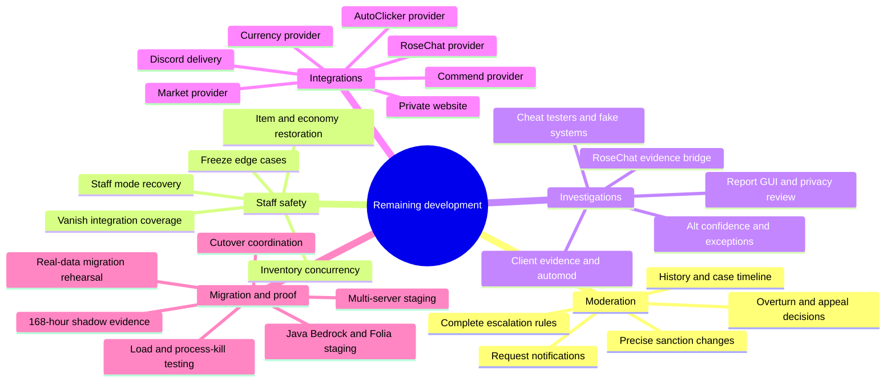

# EnthusiaStaff remaining development blueprint

This document groups the unfinished EnthusiaStaff work by feature section. It is
not a feature-status report, test guide or deployment procedure.

- `docs/wiki/pages/Implementation-Status.md` contains the readable feature
  completion marks and estimated percentages.
- `reports/REQUIREMENTS-MATRIX.md` contains exact evidence, files, tests and blockers.
- `docs/wiki/pages/Build-and-Testing.md` contains validation procedures.
- `docs/wiki/pages/LiteBans-Migration.md` and
  `docs/wiki/pages/Shadow-Mode-and-Cutover.md` contain migration operations.

## Remaining development map

## 1. Moderation completion

- Reconcile PR #27 against current `main` without losing or duplicating work.
- Add `/history` with permission-safe case and sanction timelines.
- Complete exact reduction, ending, revocation, removal and overturn behavior.
- Connect appeal decisions to the central audited sanction-change path.
- Deliver durable request lifecycle notifications to requesters and approvers.
- Finish escalation families, decay, recency, aliases, removed IDs and frozen
  policy versions.
- Apply complete operational-mode and dependency gates to moderation mutations.

**Completion condition:** retry, restart, duplicate delivery, stale state and
multi-server contention cannot change an unrelated sanction or report false
success.

## 2. Staff-state and asset safety

- Complete staff-mode checksums, revisions, crash resume and cross-server restore.
- Complete freeze restrictions, staff-only communication, reconnect and expiry.
- Finish vanish coverage across tab, entities, commands, chat, voice, effects,
  containers, completions and public APIs.
- Complete inventory/Ender concurrent viewers, dirty slots, nested containers,
  offline atomic replacement and queued patches.
- Finish item-confiscation selection, movement protection, recovery and restore.
- Reconstruct Currency integration and finish economy removal/restoration.
- Prove behavior with Java, Bedrock/Geyser and Folia runtime tests.

**Completion condition:** no crash, disconnect, stale viewer or server switch can
leak staff state, overwrite newer player data, lose an asset or create a duplicate.

## 3. Investigations and evidence

- Build the reports queue/detail GUI and modular report configuration.
- Complete RoseChat private-message evidence capture and privacy boundaries.
- Finish staff-facing evidence review and retention controls.
- Reconstruct AutoClicker evidence and strict pre-broadcast automod integration.
- Complete alt confidence aging, maintenance suppression, exceptions,
  inheritance, GUI and unread alerts.
- Finish staff tools, safe cheat testers, fake entity and virtual fake base.
- Add `/fakebase` and verify fake systems for Java and Bedrock.

**Completion condition:** staff can investigate reports, clients, alts and test
results without leaking private data or changing real player/world state.

## 4. External integrations

- Rebuild the EnthusiaCurrency moderation API.
- Rebuild Commend blacklist enforcement for every write path.
- Rebuild AutoClicker versioned evidence lookup.
- Obtain or define the supported RoseChat moderation/staff bridge.
- Rebuild Market moderation without bypassing its transaction model.
- Complete Discord event routing, sanitization, circuit/status and recovery.
- Build the private punishment/appeal site with authentication, CSRF protection,
  rate limits, restricted roles and safe media.
- Test provider classloaders and degraded behavior at declared repository revisions.

**Completion condition:** every provider works at its declared revision, and a
missing provider disables only the dependent actions with a clear explanation.

## 5. Migration and complete proof

- Complete PR #37 cutover coordination, writer fencing and emergency freeze.
- Prove migration dry run, rerun, interruption, resume, replay, reconciliation,
  source deletion, orphan mappings and rollback.
- Test real LiteBans schema variants and production-like private data volume.
- Run full Paper–Velocity multi-backend staging with no-player transport.
- Run Java, Bedrock/Geyser, Folia, provider, load, saturation and process-kill tests.
- Create one release manifest declaring every repository revision, artifact hash,
  configuration checksum and acceptance result.
- Run seven valid daily comparisons spanning at least 168 hours.
- Resolve every mismatch and rehearse rollback before changing authority.

**Completion condition:** one coherent release manifest passes all applicable
acceptance groups and the shadow record contains no unexplained mismatch.

## Current development order

1. Finish PR #37 and reconcile PR #27.
2. Complete moderation history, decisions and notifications.
3. Complete staff-state and asset-safety recovery.
4. Complete investigations and evidence workflows.
5. Reconstruct providers, Discord and the private website.
6. Run migration, topology, platform and failure acceptance.
7. Complete the 168-hour shadow evidence and rollback rehearsal.

Correctness, security and data-integrity defects may interrupt this order.

## Documentation ownership

Keep each type of information in one primary location:

| Information | Primary source |
| --- | --- |
| Finished behavior | `ENTHUSIASTAFF-GOALS.md` |
| Exact implementation evidence | `reports/REQUIREMENTS-MATRIX.md` |
| Feature percentages | `docs/wiki/pages/Implementation-Status.md` |
| Remaining implementation sections | This document and `docs/wiki/pages/Development-Blueprint.md` |
| Code paths and ownership | `docs/wiki/pages/Developer-Code-Guide.md` |
| Validation procedure | `docs/wiki/pages/Build-and-Testing.md` |
| Migration operations | LiteBans migration and shadow/cutover Wiki pages |

Do not copy commit totals, full test procedures, source maps or operator steps
into this blueprint.
