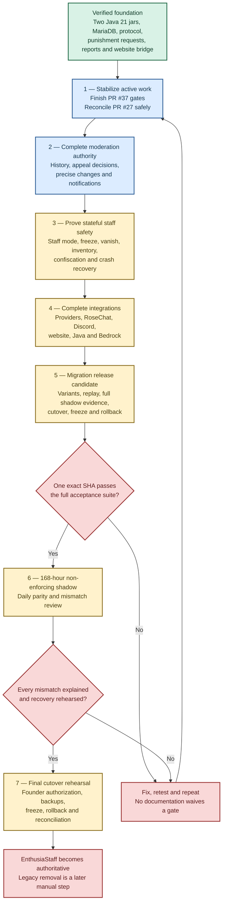

# Development Blueprint

This page is the visual path from the current repository checkpoint to a
production-authoritative EnthusiaStaff release.

Use it with:

- [[Implementation Status]] for the current conservative verdict;
- [[Architecture]] and [[Developer Code Guide]] for ownership and code paths;
- [[Build and Testing]] for validation requirements;
- `ENTHUSIASTAFF-GOALS.md` for authoritative finished behavior; and
- `reports/REQUIREMENTS-MATRIX.md` for exact evidence, remaining work and blockers.

> **Roadmap, not release promise:** a feature appearing below does not mean it is
> implemented, staged or approved for production.

## Current checkpoint

- Current `main`: `3f4e2a1164d570aadfb82522b07b4b32c9f2a7f9`
- Latest merged checkpoint: PR #36, LiteBans shadow-comparison decomposition
- Validated PR #36 head: `3afeffc926571170e8df18c7d096ca7f4d89ec1b`
- Clean validation: 40/40 tasks, 99 suites / 398 tests
- MariaDB 11.8.3 Testcontainers: 15 suites / 68 tests
- Hosted Codacy: zero new, three fixed, 92.59% diff coverage, no clone increase
- Exact-SHA Pi staging: run `30709333535`
- Active draft PR #37: LiteBans cutover coordination; focused first checkpoint only
- Separate draft PR #27: punishment-request notifications, staff mode and freeze; 95 commits requiring careful reconciliation

This proves a substantial foundation. It does not prove complete Velocity,
provider, multi-server, Bedrock, Folia, load, migration, shadow or production
acceptance.

## Road to production

## Workstream map

| Workstream | Current position | Next destination | Main blocker |
| --- | --- | --- | --- |
| Build, packaging and CI | Tested checkpoint | Repeat exact-head gates and later enforce meaningful coverage floors | Full provider/topology acceptance absent |
| Architecture and persistence | Active cleanup | Finish PR #37 and continue real responsibility splits | Large classes and limited process-kill testing |
| Punishments and requests | Interfaces tested; notification work on PR #27 | Reconcile PR #27, then history, appeals and durable delivery | Branch divergence and staging |
| Reports and evidence | Persistence tested; UI/provider partial | Report GUI, RoseChat private evidence, Discord rendering and privacy review | RoseChat provider unavailable |
| Staff mode, vanish and freeze | Partial | Reconcile PR #27, complete recovery and stage Folia/Java/Bedrock | Runtime/provider staging gaps |
| Inventory and confiscation | Partial | Concurrency, nested containers, offline replacement and failure injection | Multi-server/provider staging |
| Alts and identity | Partial | Confidence lifecycle, aliases, exceptions, GUI, alerts and key rotation | Production-like identity evidence unavailable |
| Providers and website | Root contracts/bridge partial | Reconstruct provider branches and complete private site | Missing provider work, RoseChat repository and secrets |
| LiteBans migration | Schema and shadow dimensions tested; cutover active | Finish PR #37 and realistic recovery/cutover rehearsal | Real data and 168-hour environment unavailable |
| Documentation and operations | Being refreshed | Keep Wiki, matrix, manifest, runbooks and upgrade records synchronized | Implementation changes rapidly |

## Milestone path

### 0 — Preserve the verified foundation

Exact checkpoints already demonstrate:

- two Java 21 runtime jars and provider-API packaging checks;
- MariaDB-backed moderation state and broad Testcontainers coverage;
- authenticated Paper–Velocity transport and durable outboxes;
- punishment request submission/review and authority boundaries;
- report persistence, replay, privacy filtering and evidence retention;
- restricted signed website transport, public projections, codes and appeal contracts;
- improved vanish scheduling and recovery;
- deterministic LiteBans schema inspection and persisted shadow dimensions;
- standalone Paper boot/storage/command/shutdown staging.

Every later phase must preserve these guarantees.

### 1 — Converge active development

Finish PR #37's cutover work and full gates. Review PR #27 against the latest
`main`, preserve its notification/staff-mode/freeze behavior and resolve overlap
without parallel sources of truth.

**Exit gate:** clean build, all MariaDB suites, two jar inspection, Wiki
validation, hosted quality checks, exact-head Pi staging when eligible and one
new documented root checkpoint.

### 2 — Complete moderation authority

Deliver `/history`, precise sanction reduction/ending/revocation/removal,
overturn and appeal-linked decisions, durable request lifecycle notifications,
offline/restart-safe delivery, complete escalation policy and precise
operational-mode gates.

### 3 — Prove stateful staff and asset safety

Stage staff-mode snapshots and recovery, complete freeze restrictions, broad
vanish coverage, inventory/Ender concurrency and offline replacement, item and
economy confiscation/restoration, staff tools, fake entities and `/fakebase`.

### 4 — Complete providers and website

Implement supported contracts in EnthusiaCurrency, EnthusiaCommend,
EnthusiaAutoClicker, RoseChat and EnthusiaMarket. Complete live Discord delivery
and the private punishment/appeal site with authentication, CSRF, rate limits,
restricted roles, safe media and integration tests. Stage Java, Bedrock/Geyser,
Voice, ViaVersion and CombatLogX behavior.

### 5 — Reach migration-ready status

Prove LiteBans variants, blockers, dry run, rerun, interruption, replay,
reconciliation, source deletion, orphan mappings, full persisted shadow
comparisons, seven daily summaries spanning 168 hours, final incremental import,
activation fencing, emergency freeze and rollback against realistic private data.

### 6 — Full acceptance

One exact SHA and matching jars must pass build, packaging, Codacy, MariaDB,
Paper, Velocity, provider, website, Java, Bedrock, Folia, multi-backend, load,
failure-injection, recovery and rollback groups. Evidence from different commits
cannot be combined.

### 7 — Shadow and cutover

Run the mandatory 168-hour non-enforcing shadow period and review every daily
comparison. Rehearse cutover, emergency freeze and rollback immediately before
Founder-authorized activation. Keep LiteBans data and jars available; legacy
removal is a later manual decision.

## Immediate execution order

1. Complete PR #37 implementation, full gates and review.
2. Rebase and reconcile PR #27 without losing or duplicating its 95-commit work.
3. Establish and document the next clean `main` checkpoint.
4. Complete punishment history and appeal-linked decisions.
5. Connect request lifecycle events to durable network/Discord delivery.
6. Finish modular configuration and operational-mode transitions.
7. Complete report GUI/privacy and the supported RoseChat evidence bridge.
8. Stage staff mode, freeze, vanish, inventory and confiscation safety.
9. Reconstruct providers and complete the private website.
10. Finish migration recovery, full shadow, emergency freeze and rollback.
11. Run full acceptance, the 168-hour shadow period and cutover rehearsal.

Correctness, security, transaction integrity, recovery and resource ownership may
interrupt this order at any time.

## Feature definition of done

A feature is not complete until all applicable layers are covered:

1. Goals, authority and privacy rules
2. Central domain behavior
3. Durable schema, constraints, indexes and transactions
4. Idempotency, revisions, leases, fencing, audit and recovery
5. Paper, Velocity, provider or website adapter
6. Hostile-input and permission tests
7. Duplicate, stale-state, restart, failure and concurrency tests
8. Real staging where mocks cannot prove behavior
9. Accurate verification and degraded-mode output
10. Configuration, operator, privacy, rollback and Wiki documentation
11. Requirements-matrix evidence at one exact SHA

## Keeping this roadmap current

When a verified checkpoint changes:

1. Update `reports/REQUIREMENTS-MATRIX.md` and `WORKSPACE-MANIFEST.md`.
2. Update this page and [[Implementation Status]].
3. Update affected staff, operator, migration and developer pages.
4. Run `python scripts/wiki/validate_wiki.py`.
5. Publish only from reviewed repository source.