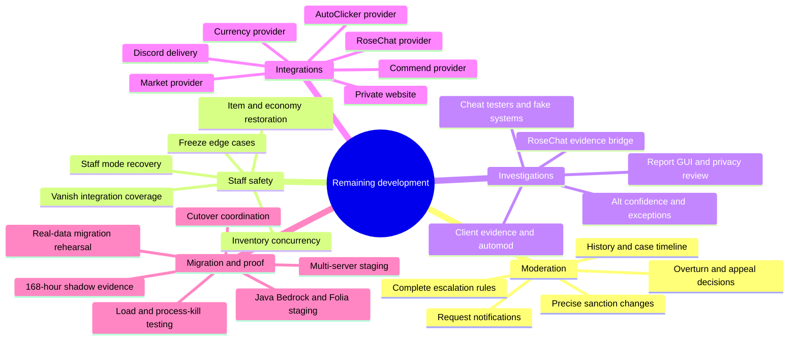

# Remaining Development Map

This page shows **which feature sections still need development** and the order in
which they should be completed. It does not repeat feature percentages, test
commands or deployment/cutover instructions.

- See [[Feature Completion Status|Implementation-Status]] for percentages and
  feature-by-feature remaining work.
- See [[Build and Testing]] for validation requirements.
- See [[LiteBans Migration]] and [[Shadow Mode and Cutover]] for migration and
  release procedures.

## Development map

## Section 1 — Moderation completion

Complete these together because they share case history, sanction state,
authorization and notification paths.

1. Reconcile PR #27 without losing or duplicating its punishment-request work.
2. Add `/history` with permission-safe case and sanction timelines.
3. Finish exact reduction, ending, revocation, removal and overturn behavior.
4. Connect appeal decisions to the same audited sanction-change path.
5. Deliver request submitted, claimed, approved, denied, expired and fulfilled
   notifications through durable network and Discord delivery.
6. Complete escalation families, decay, recency, aliases, removed IDs and frozen
   policy versions.
7. Apply operational-mode and dependency gates to every moderation mutation.

**Section is done when:** the complete workflow survives retry, restart,
duplicate delivery, stale state and multi-server contention without changing an
unrelated sanction.

## Section 2 — Staff-state and asset safety

These features can lose or duplicate player state if completed independently, so
shared ownership, journals and recovery rules must be settled first.

1. Finish staff-mode snapshots, checksums, revisions, crash resume and safe
   cross-server restore.
2. Complete freeze restrictions, staff-only communication, reconnect behavior and
   offline expiration.
3. Finish vanish coverage for tab, entity tracking, commands, chat, voice,
   effects, containers, completions and public APIs.
4. Complete inventory/Ender concurrent viewers, dirty slots, nested containers,
   offline atomic replacement and queued login patches.
5. Finish item confiscation selection, movement bypass protection, recovery and
   idempotent restoration.
6. Reconstruct Currency integration and finish economy removal/restoration.
7. Run live Java, Bedrock/Geyser and Folia ownership/recovery tests.

**Section is done when:** crashes, disconnects, server switches and stale viewers
cannot leak staff items, overwrite newer inventory state, lose assets or create
duplicates.

## Section 3 — Investigations and evidence

1. Build the report queue/detail GUI and modular report configuration.
2. Complete RoseChat private-message evidence capture without exposing private
   evidence to Discord.
3. Finish staff-facing privacy review and evidence-retention controls.
4. Reconstruct AutoClicker evidence and strict pre-broadcast automod integration.
5. Complete alt confidence aging, maintenance suppression, household/approved
   exceptions, inheritance, GUI and unread alerts.
6. Finish the staff hotbar, safe cheat testers, fake entity and virtual fake base.
7. Add `/fakebase` and verify fake systems for Java and Bedrock clients.

**Section is done when:** staff can investigate reports, clients, alts and test
results without leaking private data or modifying real player/world state.

## Section 4 — External integrations

Each integration remains independently optional and must fail without disabling
unrelated moderation features.

1. Rebuild and test the EnthusiaCurrency moderation API.
2. Rebuild Commend blacklist enforcement across GUI, command and API writes.
3. Rebuild AutoClicker versioned evidence lookup.
4. Obtain or define the supported RoseChat moderation/staff bridge.
5. Rebuild Market stall-moderation support without bypassing its transaction model.
6. Complete Discord routing, sanitization, circuit/status controls and recovery.
7. Build the private punishment/appeal site with sessions, CSRF protection, rate
   limits, restricted roles and safe media handling.
8. Run provider classloader and degraded-mode staging using declared repository
   revisions.

**Section is done when:** each provider works at its declared revision and a
missing provider disables only its own dependent actions with a clear reason.

## Section 5 — Migration and complete proof

This section begins after the feature sections above are stable enough to compare
against LiteBans under realistic conditions.

1. Complete PR #37 cutover coordination, writer fencing and emergency freeze.
2. Prove migration dry run, rerun, interruption, resume, replay, reconciliation,
   source deletion, orphan mappings and rollback.
3. Test real LiteBans schema variants and production-like private data volume.
4. Run full Paper–Velocity multi-backend staging with no online-player transport.
5. Run Java, Bedrock/Geyser, Folia, provider, load, queue-saturation and
   process-kill scenarios.
6. Create one release manifest listing the exact revision and artifact/config
   evidence for every participating repository.
7. Run seven valid daily comparisons spanning at least 168 hours.
8. Resolve every mismatch and rehearse rollback before production authority can
   change.

**Section is done when:** one coherent release manifest passes all applicable
acceptance groups and the complete shadow record has no unexplained mismatch.

## Current development order

1. Finish PR #37 and reconcile PR #27.
2. Complete moderation history, decisions and notifications.
3. Complete staff-state and asset-safety recovery.
4. Complete investigations and evidence workflows.
5. Reconstruct providers, Discord and the private website.
6. Run migration, topology, platform and failure acceptance.
7. Complete the 168-hour shadow evidence and final rollback rehearsal.

A serious correctness, security or data-integrity defect may interrupt this order.

## Keeping this page focused

Do not add feature percentages, commit/test totals, detailed source maps or
operator procedures here. Those belong in:

- [[Feature Completion Status|Implementation-Status]]
- [[Developer Code Guide]]
- [[Build and Testing]]
- [[LiteBans Migration]]
- [[Shadow Mode and Cutover]]
